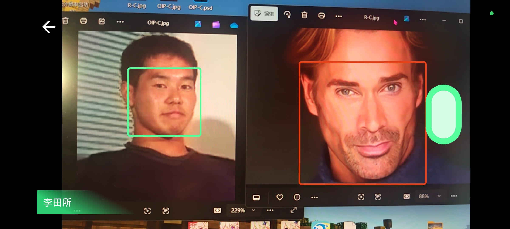

# 基于AI模型的教室群体人脸签到系统设计

我在大学电子信息工程专业2025年毕业时毕设。分为前端和后端两部分。

## 功能展示

1. 电脑挂载本地服务器后，手机与其处于一个局域网内。手机浏览器输入网址访问网站。该例子使用Edge浏览器，[并已提前为网站安全策略绕行](#trouble-shooting)。
 

2. 点击录入学生，随机选择一张网络图片作为头像。上传。
 

3. 回到教室列表页面，通过后端修改数据库将该学生学号添加至教室内

4. 查看教室签到状态
 

5. 用手机拍摄电脑屏幕来模拟在教室内同时拍摄多张人脸。可以观察到该学生已被识别到，而没有事先录入数据库的学生并没有被识别
 

6. 查看签到结果
 

## Requirement

- 需要[安装Rust](https://www.rust-lang.org/tools/install)。因为暂时没有提供预编译程序，因此需要自己编译。
- 需要[安装nodejs](https://nodejs.org/)。
- 需要[安装protoc](https://github.com/protocolbuffers/protobuf/releases)，并放在`PATH`环境变量中。

## Usage

在运行前请确保安装了[Requirement](#requirement)章节中所有必要组件。然后先生成gprc绑定，后续运行中无需再重复生成。

### 环境配置和生成grpc绑定

#### 后端

不需要额外操作，但需要`protoc`。最好保持protoc始终可用，否则cargo重新运行build脚本时会出错。

#### 前端

```sh
cd web
npm i pnpm -g # 安装pnpm，已安装可跳过
pnpm i
pnpm rpc
```

### 启动后端

```sh
cd backend
cargo r
```

### 启动前端

```sh
cd web # 已在web目录下就无需执行
pnpm dev
```

## Trouble shooting

### 摄像头访问不了

大部分浏览器限制了没有使用HTTPS加密的非本地网站访问摄像头。需要在`chrome://flags/`里的`Insecure origins treated as secure`条目给服务器地址放行。
